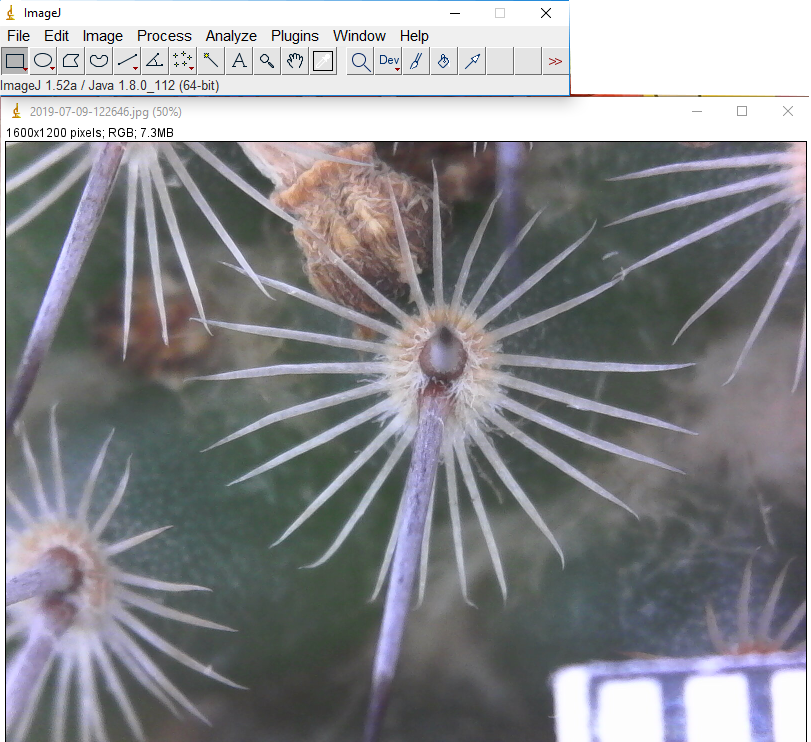
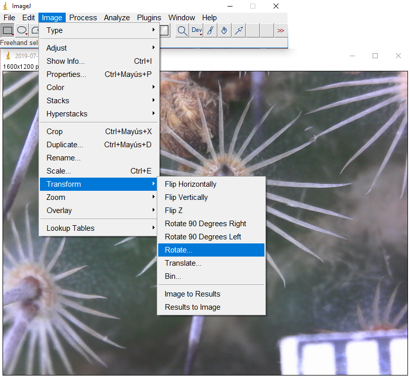
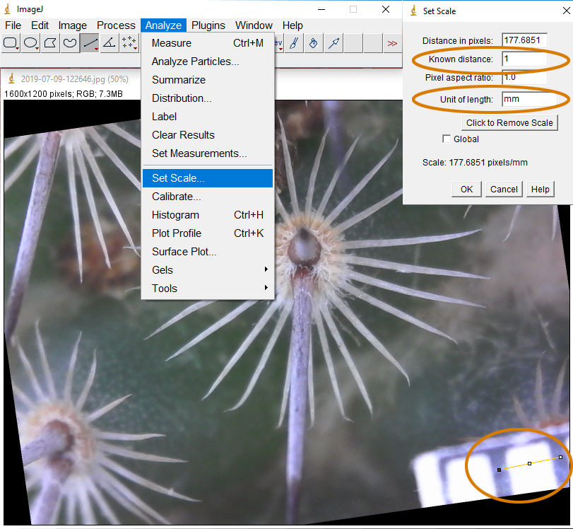
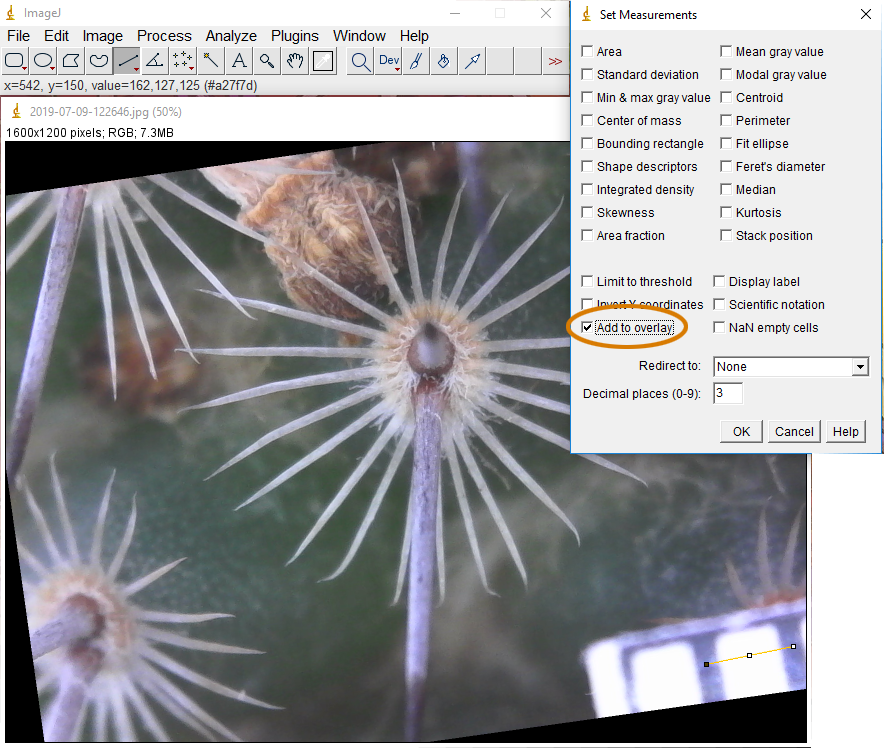
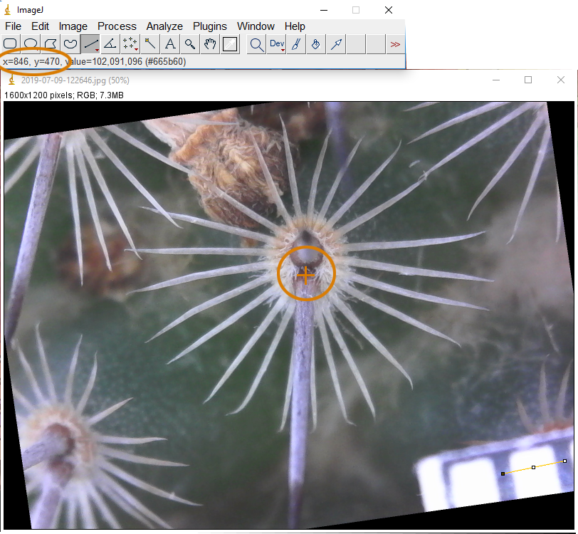
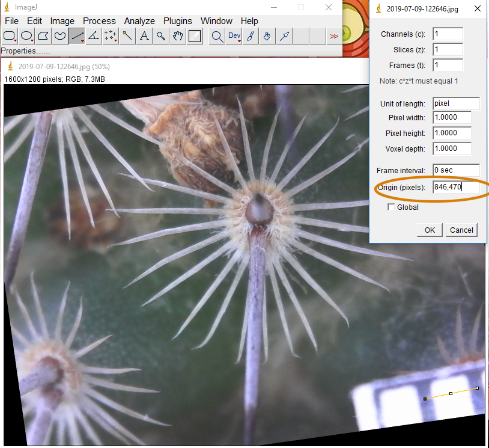
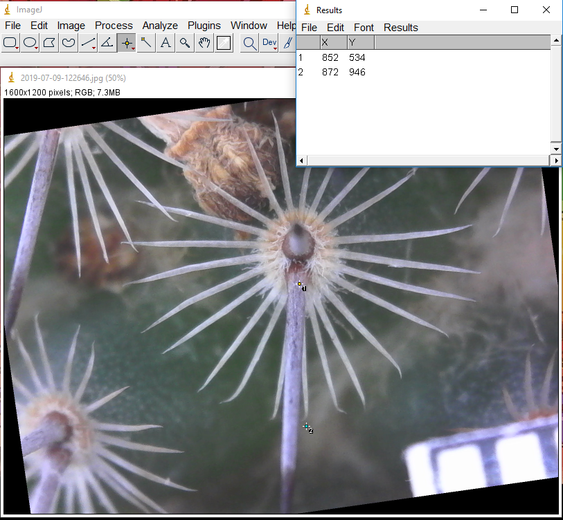
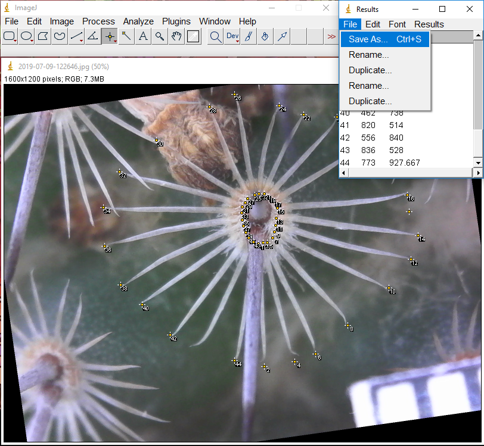

## Morphometric analysis of the spines of *Mammillaria haageana*

### Process to measure radial spines

#### 1.- Run ImageJ and open your image `(ctrl + o)`.

Fig. 1.- Open image.

#### 2.- If your image is not centered, you have to rotate.  

Fig. 2.- Rotate image.

#### 3.- Is necessary to adjust the scale, so you have to select the straight line tool and put one line in your scale. Then modify the Known distance and Unit of length.

Fig. 3.- Adjust the scale.

#### 4.- I recommend deselecting all the Set Measures and select only Add to overlay.

Fig. 4.- Select only Add to overlay.

#### 5.- You have to put the cursor in the center of the areole and annotate the x-axis and y-axis,  that it is shown in the top left-hand corner.

Fig. 5.- Put the cursor in the center of the areole.

#### 6.- Then you have to modify the Origin (pixels) with the x-axis and y-axis annotated in the previous step.

Fig. 6.- Modify the Origin (pixels).

#### 7.- You have to select the point tool and locate it in where the spine begins, then press the key `m` to measure the point. Now put the point tool in where the spine ends and press the key `m` again.

Fig. 7.- Measure the first points.

#### 8.- Repeat this pattern with all the spines and save the file.

Fig. 8.- Repeat and Save the file.

